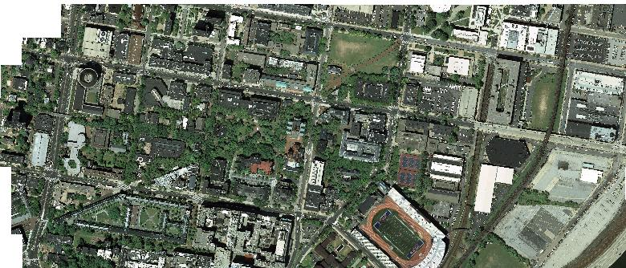
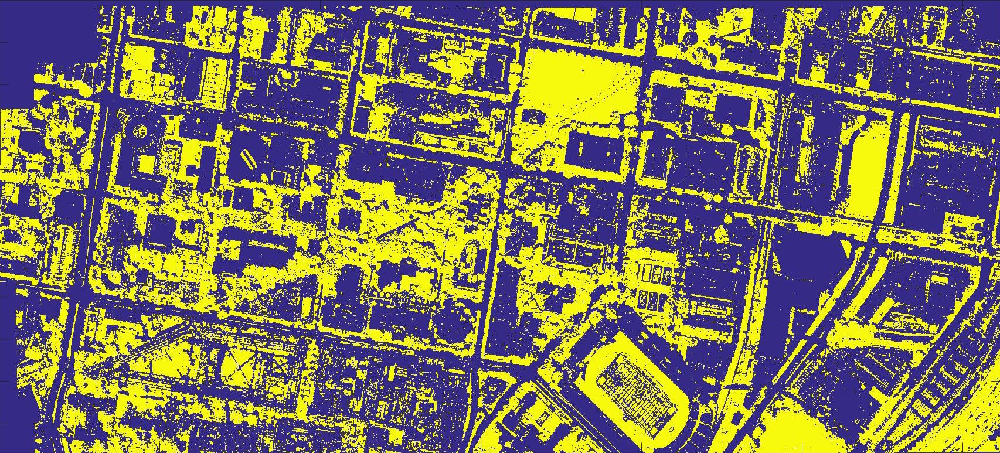
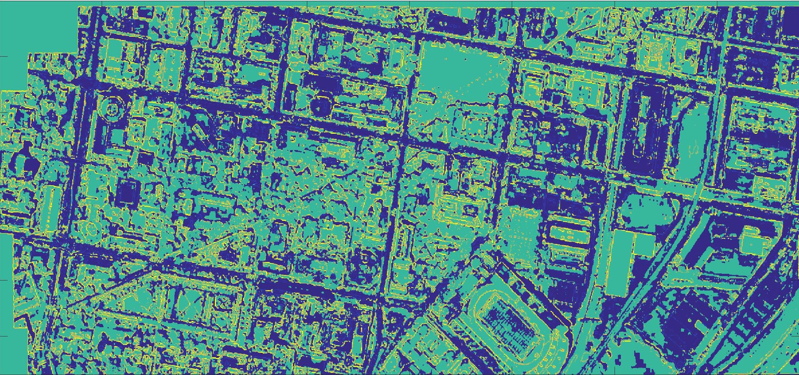
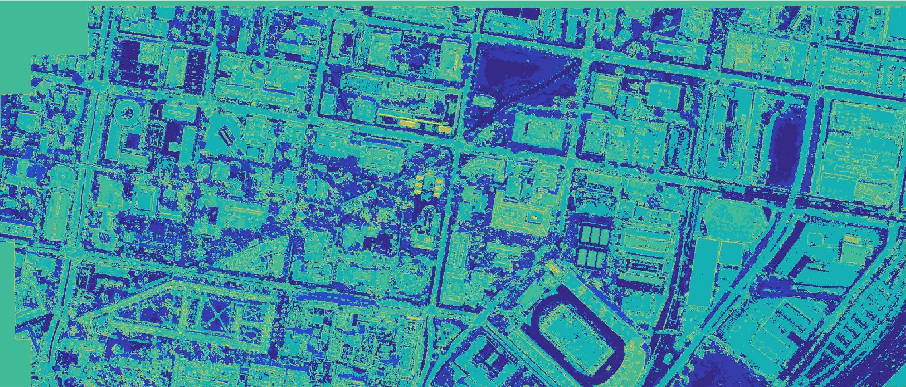

## Path Planning on Aerial Map with Imitation Learning

UPenn ESE 650 Learning in Robotics, Project 5

- Detailed project description can be found at [report/ese650proj5_report_luyiren.pdf](report/ese650proj5_report_luyiren.pdf)
- Presentation slides can be found at [report/ese650proj5_slides_luyiren.pdf](report/ese650proj5_slides_luyiren.pdf)

#### Contents

- Execute `submission/path_planning_test.m`
- Driving and walking feature maps and cost maps are in `submission/feat_eng_maps5` and `submission/walk_feat_maps` respectively.

#### Visualizations

- Greens

- Cost map for driving

- Cost map for walking

